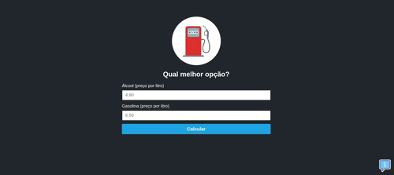

# Calculadora de Combustível

Este é um projeto de uma calculadora de combustível simples, desenvolvido em  HTML, CSS e JavaScript, que permite aos usuários calcular qual combustível (álcool ou gasolina) é mais vantajoso em termos de preço por litro.



## Funcionalidades

- **Comparação de Preços:** A calculadora compara o preço do litro do álcool com o preço do litro da gasolina e informa qual combustível é mais vantajoso.
- **Dicas para Economizar:** Além de calcular o preço do combustível, o projeto também fornece dicas úteis para economizar combustível ao dirigir.

## Como Usar

1. Clone o repositório para sua máquina local:

```bash
git clone https://github.com/ronaldocipriiano/calculadora-combustivel.git
```
2. Abra o arquivo index.html em seu navegador.

3. Insira o preço por litro do álcool e da gasolina nos campos fornecidos.

4. Clique no botão "Calcular" para ver qual combustível é mais vantajoso.


## Contribuindo
Contribuições são bem-vindas! Sinta-se à vontade para abrir uma issue ou enviar um pull request com melhorias, correções de bugs ou novas funcionalidades.

## Autor

[GitHub - ronaldocipriiano](https://github.com/ronaldocipriiano/)

## Licença
Este projeto está licenciado sob a Licença MIT - veja o arquivo [LICENSE](/LICENSE) para mais detalhes.